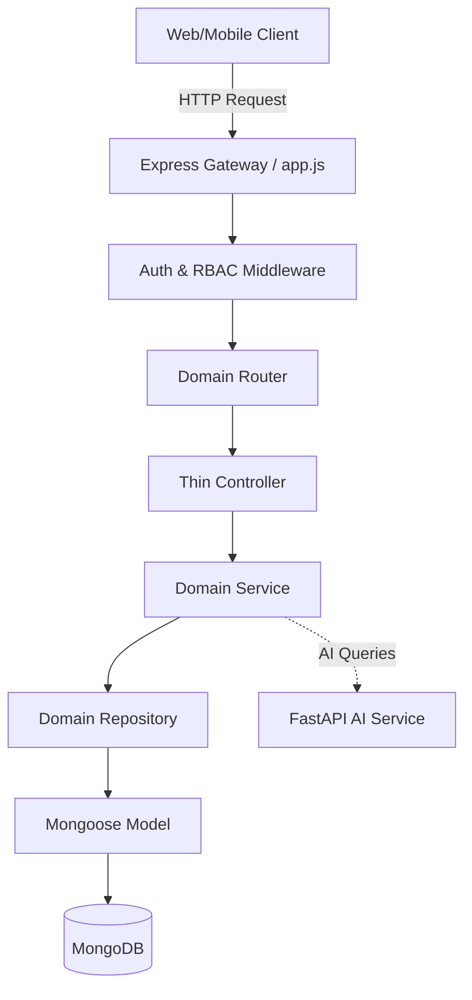

# BIS-SATHI Primary Server - Architecture & Documentation

## 1. Backend Overview
The `primary-server` is a Node.js + Express backend designed as the exclusive, secure API Gateway for the BIS-SATHI web and mobile applications. It follows a strict **Domain-Driven Modular Architecture**, ensuring business logic isolation, scalability, and robust security through JWT-based authentication, RBAC authorization, and native IDOR prevention on MongoDB lookups.

## 2. Architecture & Request Lifecycle
This server explicitly enforces a **4-Tier Data Flow** ensuring extreme separation of concerns across the domains:



### Separation of Concerns
- **Controllers** (`src/controllers/*.controller.js`) strictly handle request parsing, invoke the relevant service, and wrap the return data in standardized `ApiResponse` payloads. They contain ZERO business logic or database queries.
- **Services** (`src/services/*.service.js`) strictly handle domain-specific business rules, throwing `ApiError` validations, and external integrations (e.g., Axios to FastAPI). They contain ZERO direct Mongoose queries.
- **Repositories** (`src/repositories/*.repository.js`) strictly encapsulate the database queries. They execute `.find()`, `.create()`, `.findOne()` etc., on the raw Mongoose Models. They contain ZERO business logic or validation blocking.

---

## 3. Complete API Inventory & File Mapping

### A. Authentication & User Module (`auth`)
*Handles JWT generation, registration, login, and secure token refresh.*
| Endpoint | Controller | Service | Repository | Model |
|----------|------------|---------|------------|-------|
| `POST /api/v1/auth/register` | `auth.controller.js` | `auth.service.js` | `user.repository.js` | `User` |
| `POST /api/v1/auth/login` | `auth.controller.js` | `auth.service.js` | `user.repository.js` | `User` |
| `GET /api/v1/auth/me` | `auth.controller.js` | `auth.service.js` | `user.repository.js` | `User` |
| `POST /api/v1/auth/refresh` | `auth.controller.js` | `auth.service.js` | `user.repository.js` | `User` |
| `POST /api/v1/auth/logout` | `auth.controller.js` | `auth.service.js` | `user.repository.js` | `User` |
| `POST /api/v1/auth/forgot-password`| `auth.controller.js` | `auth.service.js` | `user.repository.js` | `User` |
| `POST /api/v1/auth/reset-password` | `auth.controller.js` | `auth.service.js` | `user.repository.js` | `User` |
| `POST /api/v1/auth/change-password`| `auth.controller.js` | `auth.service.js` | `user.repository.js` | `User` |

### B. Public Discovery Modules (`standards`, `qcos`, `labs`, `resources`)
*Handles reading public domain resources.*
| Endpoint | Controller | Service | Repository | Model |
|----------|------------|---------|------------|-------|
| `GET /api/v1/standards` | `standards.controller.js` | `standards.service.js` | `standards.repository.js` | `Standard` |
| `GET /api/v1/qcos` | `qco.controller.js` | `qco.service.js` | `qco.repository.js` | `QCO` |
| `GET /api/v1/labs` | `labs.controller.js` | `labs.service.js` | `labs.repository.js` | `Laboratory` |
| `GET /api/v1/resources` | `resources.controller.js` | `resources.service.js` | `resources.repository.js` | `Resource` |
*(Note: Each domain also exposes a `/:id` detail endpoint mapped identically to the above)*

### C. Private Interaction Modules (`saved`, `reports`, `compliance`, `comparison`)
*Handles authenticated interactions strictly enforced via IDOR protections.*
| Endpoint | Controller | Service | Repository | Model |
|----------|------------|---------|------------|-------|
| `GET /api/v1/saved` | `saved.controller.js` | `saved.service.js` | `saved.repository.js` | `SavedItem` |
| `POST /api/v1/saved` | `saved.controller.js` | `saved.service.js` | `saved.repository.js` | `SavedItem` |
| `DEL /api/v1/saved/:id` | `saved.controller.js` | `saved.service.js` | `saved.repository.js` | `SavedItem` |
| `GET /api/v1/reports` | `reports.controller.js` | `reports.service.js` | `reports.repository.js` | `Report` |
| `GET /api/v1/compliance/journeys` | `compliance.controller.js` | `compliance.service.js` | `compliance.repository.js` | `ComplianceJourney` |
| `POST /api/v1/comparison` | `comparison.controller.js` | `comparison.service.js` | `comparison.repository.js` | `(Polymorphic)` |

### D. AI & Assistant Modules (`session`, `chat`)
*Handles communication directly through the Node gateway into the private FastAPI layer.*
| Endpoint | Controller | Service | Repository | Model |
|----------|------------|---------|------------|-------|
| `POST /api/v1/sessions` | `session.controller.js` | `session.service.js` | `session.repository.js` | `Session` |
| `GET /api/v1/sessions` | `session.controller.js` | `session.service.js` | `session.repository.js` | `Session` |
| `GET /api/v1/sessions/:id/messages`| `session.controller.js`| `session.service.js` | `session.repository.js` + `message.repository.js` | `Message` |
| `POST /api/v1/chat` | `chat.controller.js` | `chat.service.js` | `session.repository.js` + `message.repository.js` | `Message` |

### E. Administrator Module (`admin`)
*Strictly guarded by `requireRole('ADMIN')` middleware.*
| Endpoint | Controller | Service | Repository | Model |
|----------|------------|---------|------------|-------|
| `GET /api/v1/admin/users` | `admin.controller.js` | `admin.service.js` | `user.repository.js` | `User` |
| `POST /api/v1/admin/standards` | `admin.controller.js` | `admin.service.js` | `standards.repository.js`| `Standard` |

---

## 4. Security & Middleware
### Authentication Flow (`auth.middleware.js`)
Uses Short-Lived Access Tokens (Default `15m`) and Long-Lived Refresh Tokens. Extracted as a Bearer Token mapping strictly to user identity (`req.user._id`).
### IDOR Prevention Strategy
All database mutations inside Private/Interaction modules are tightly queried alongside `req.user._id` natively within the Repository Layer queries.
```javascript
// Example native IDOR protection inside a repository
const findReportByOriginalId = async (userId, id) => {
  return await Report.findOne({ originalId: id, userId }).lean();
};
```
### AI Gateway Safety (`chat.service.js`)
The FastAPI AI service is **NEVER** publicly exposed to frontend requests. The Node backend parses incoming requests, utilizes `message.repository.js` to create the database record chronologically, securely forwards the payload behind-the-scenes to `localhost:8001`, awaits the response, and persists the generated assistant `Message` back into the user's `Session`.
